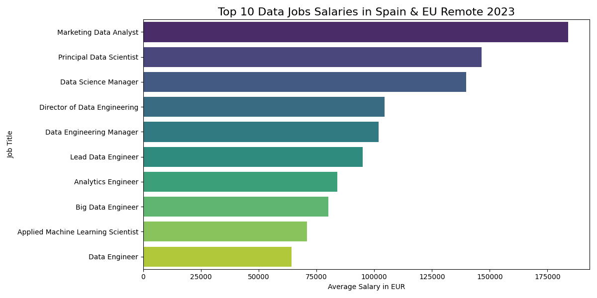

# Análisis de Salarios Data en España 2023 🇪🇸

## Objetivo
Analizar los salarios reales de profesionales de Data en España y en remoto para la UE usando Python, Pandas y Visualización de Datos.

## Resultados Clave
- Visualización de los 10 puestos mejor pagados en Data
- Comparación entre salarios locales vs remotos en Europa
- Uso de datos reales de Kaggle

## Herramientas
Python, Pandas, Matplotlib, Seaborn, Jupyter

## Conclusión
El mercado español de datos está en crecimiento. Hablar portugués + español es una ventaja competitiva.

